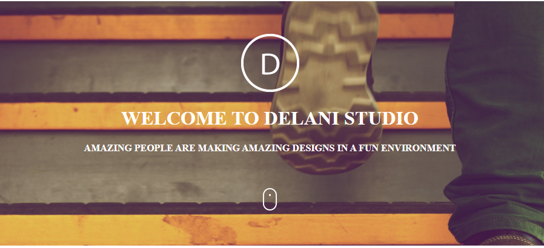

# DELANI STUDIO
## Description.
This is a web application for Delani studio which gives a detailed account about who they are, what services they offer, a portfolio section with projects they have done and a contact form that allows users to send in their feedback or ask questions.
## Author.
Jackline M Mutegi
## live Page
https://github.com/JacklineMM/Delani-Studio

## Screenshot

## Setup.
Open terminal {Ctrl+Alt+T}
git clone https://github.com/JacklineMM/Delani-Studio.git
extract the file.
cd to the Delani-studio directory.
Open the ``index.html`` on your favorite browser.
## Behavior Driven Development

## Technologies used.
* Html
* Bootstrap
* Css
* Javascript
* Jquery
* Markdown
​
## Known Bugs
* No known bugs.
​
## License
> Copyright <2023> <Jackline Mutegi>

Permission is hereby granted, free of charge, to any person obtaining a copy of this software and associated documentation files (the “Software”), to deal in the Software without restriction, including without limitation the rights to use, copy, modify, merge, publish, distribute, sublicense, and/or sell copies of the Software, and to permit persons to whom the Software is furnished to do so, subject to the following conditions:

The above copyright notice and this permission notice shall be included in all copies or substantial portions of the Software.

THE SOFTWARE IS PROVIDED “AS IS”, WITHOUT WARRANTY OF ANY KIND, EXPRESS OR IMPLIED, INCLUDING BUT NOT LIMITED TO THE WARRANTIES OF MERCHANTABILITY, FITNESS FOR A PARTICULAR PURPOSE AND NONINFRINGEMENT. IN NO EVENT SHALL THE AUTHORS OR COPYRIGHT HOLDERS BE LIABLE FOR ANY CLAIM, DAMAGES OR OTHER LIABILITY, WHETHER IN AN ACTION OF CONTRACT, TORT OR OTHERWISE, ARISING FROM, OUT OF OR IN CONNECTION WITH THE SOFTWARE OR THE USE OR OTHER DEALINGS IN THE SOFTWARE. 
​
## Contact information
For feedback, questions or insights kindly reach me at [jacquemakena@gmail.com]